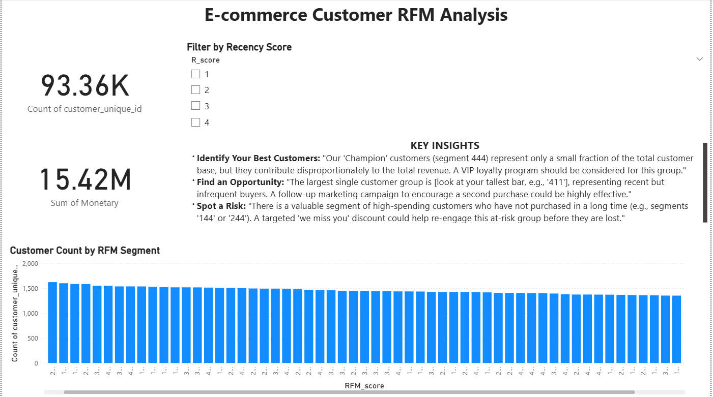

# E-commerce Customer RFM Analysis

## Project Overview

This project performs a customer segmentation analysis for an e-commerce dataset using the RFM (Recency, Frequency, Monetary) model. The goal is to identify key customer segments, understand their purchasing behavior, and provide actionable insights for targeted marketing strategies. The entire analysis was conducted in Python (Pandas) and visualized in an interactive Power BI dashboard.

---

## Data Source

The dataset used for this analysis is the ["Brazilian E-Commerce Public Dataset by Olist"](https://www.kaggle.com/datasets/olistbr/brazilian-ecommerce), which is publicly available on Kaggle. It contains over 100,000 orders from 2016 to 2018.

---

## Tools Used

* **Data Analysis:** Python, Pandas, Jupyter Notebook
* **Data Visualization:** Power BI

---

## Analysis & Methodology

The analysis followed these key steps:
1.  **Data Cleaning & Preparation:** Loaded multiple CSV files, merged them into a single dataset, handled missing values, and converted data types for analysis.
2.  **RFM Calculation:** Calculated the Recency, Frequency, and Monetary value for each unique customer.
3.  **RFM Scoring:** Grouped the R, F, and M values into quartiles to assign scores from 1 to 4, creating a combined RFM score for segmentation.

---

## Key Insights

* **Best Customers (Champions):** Our 'Champion' customers (segment 444) represent only a small fraction of the total customer base but contribute disproportionately to total revenue. A VIP loyalty program should be considered for this group.
* **Largest Segment (Opportunity):** The largest customer segment consists of recent but infrequent buyers (e.g., segment 411). A follow-up marketing campaign to encourage a second purchase from this group could be highly effective.
* **At-Risk Segment:** A valuable segment of high-spending customers has not purchased in a long time (e.g., segments '144', '244'). A targeted 'we miss you' campaign could help re-engage this group.

---

## Dashboard Preview

Below is a screenshot of the final Power BI dashboard created to visualize these findings.

